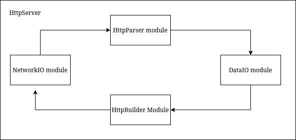

# HTTP Server in C
Mostly from scratch (i.e. no external libraries apart from that available in standard Linux distributions).

## Example usage
**DISCLAIMER**: THIS IS NOT YET READY TO USE. A LOT OF THINGS ARE STILL HARDCODED, SUCH AS ONLY ALLOWING `hello.txt` FROM `allowed_files` DIRECTORY.

This library is header-only, so once you copy the entire `lib` directory into your project root, you should be good to go. Feel free to compile then link as a shared object or static library so that your repo is less cluttered.

```c
// in main.c of project root

#include "./lib/http_server.h"

int main() {
  struct HttpServer *http_server = get_http_server(8080);
  run_http_server(http_server);

  return 0;
}
```

## Motivation
There are a few reasons why I wanted to do this. In no particular order:

- I first came across the idea from the Youtube channel Low Level. He suggested a good way to learn programming is to write an HTTP server in C. I then came across ThePrimeagen talking about the same thing.
- I'm interested in compilers (I've also been following Crafting Interpreters by the wonderful Robert Nystrom!), and since HTTP servers involves writing a parser (albeit simple), it seemed like a good start.
- To learn (under the hood) how network libraries works, at least at the application layer, and how it interacts with the Linux kernel through syscalls and the transport layer.
- I'm interested in systems programming.
- I've never fully understood what the composite phrase "event-driven single-threaded non-blocking asynchronous I/O". Maybe this would teach me?
- I've never understood how to apply the concept of "state machine".
- Perhaps, it may make me a more _appreciative_ C++/Rust developer.

## Architecture


This is the planned architecture. Currently, the server is HTTP/0.9 compliant only, hence the HTTP response only includes the file data, so the `HttpBuilder` module is not used nor is it implemented yet. I plan to use it to build the correct HTTP response, such as the status.

## Writeup

Things I want to cover:
- Why single-threading instead of multi-threading, and what challenges single-threading brings. This includes using `epoll`, how `recv` is blocking.
- How TCP is a stream-oriented protocol (and hence the name `SOCK_STREAM`), which means there's no message boundary for HTTP messages. Partial buffers means I required per-client queues. Can discuss memory tradeoff and how that may or may not be an issue.
- How the two issues of array shifting problem and failed `process_connection_buffer` calls are alleviated via `memmove`.
- How the DataIO is still blocking and how I plan to improve that.
- The idea of a (finite) state machine and how it's implemented in the `HttpParser` module.
- `epoll` issues with edge-triggered interfaces, and what design tradeoff it involves.
- Exploration of nginx and how I can learn from them to improve my design.

## Future plan
- Async engine for the `DataIO` module. This is quite big, since it requires the entire `HttpServer` to maintain state for each connection. In other words, the entire `HttpServer` needs to be re-designed to become a more sophisticated state machine.

## Learning notes
- Why use preprocessor macros instead of `const`?
- `select` vs `poll` vs `epoll`? How about the `pselect`, `ppoll` alternatives?
- `strncmp` vs `strcmp`? How to deal with non-null-terminated strings?
- Why always pass in pointers of caller-created objects into functions?
- What the closest thing to "constructors", "destructors" and "member functions" look like in C, in my opinion.
- `memmove` vs `memcpy`
- The issues of non-null-termination.

## TODOs/edge cases to consider
- What if the user sends a lot of superfluous \n or \r characters in their message/uri? Should we strip them away?
- What if the user sends multiple (like a lot) of \r\n (i.e. CLRFCLRFCLRFCLRF...)? We only find the first CLRF. Should we clear them as well? Otherwise, it will be found as CLRF in the next iteration, but then passed onto `parse_simple_request` as an _empty_ HTTP request... then we of course reject them.
- Check for any potential memory leaks.
